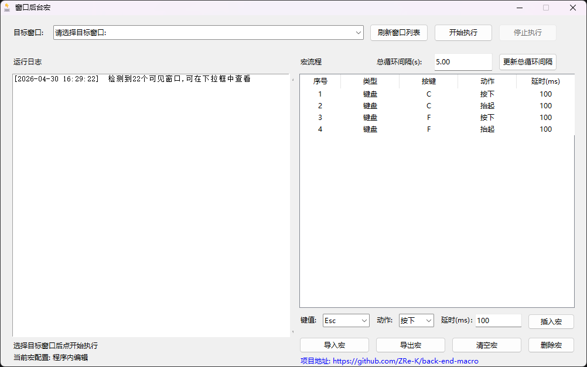
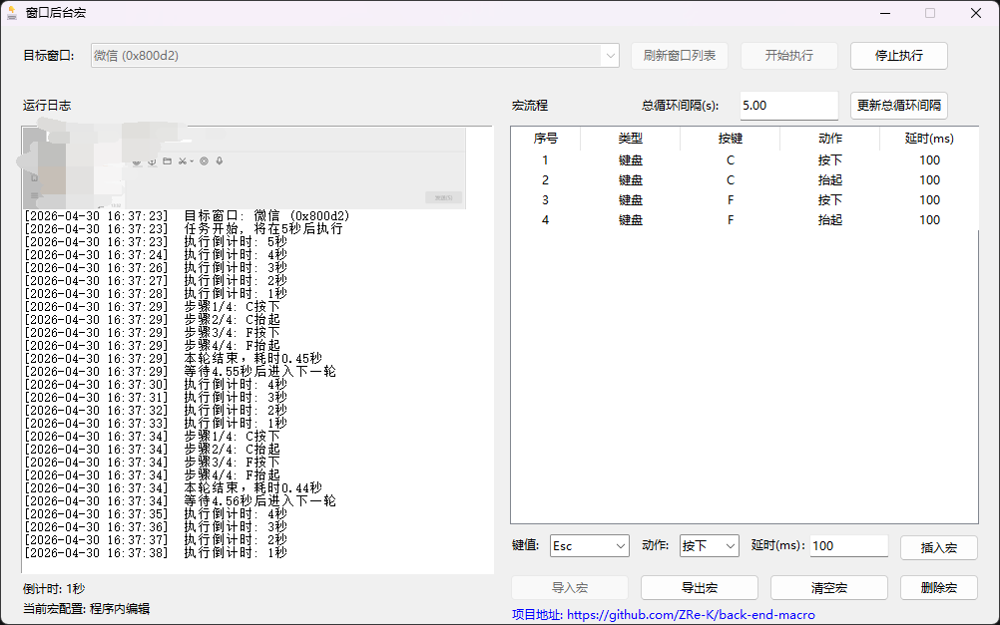

# back-end-macro

创建宏并允许对后台窗口执行宏

## 软件界面

通过配置宏，选择目标窗口后即可执行宏，并将执行日志输出。

允许导出宏配置为json文件，同时允许对应json文件导入。

导入对应json文件后，程序会在运行目录生成macro_config.json文件，用于将导入宏配置设为默认宏。

如果本程序对你有帮助，欢迎支持作者

> 微信支持

> 支付宝支持

